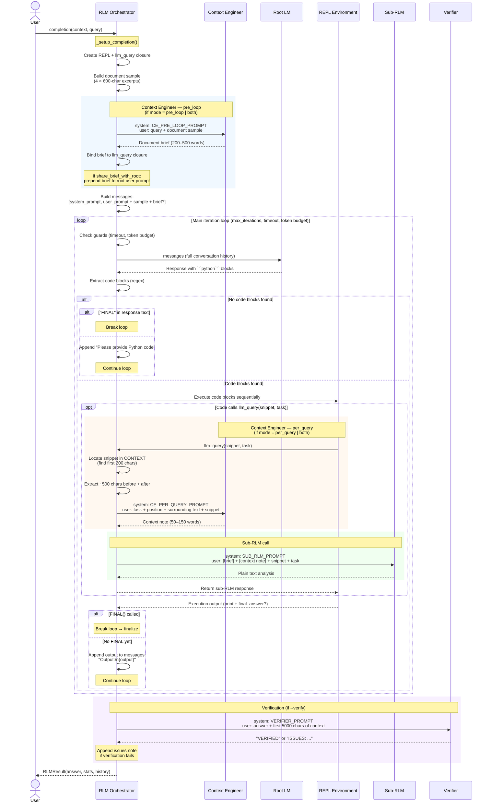
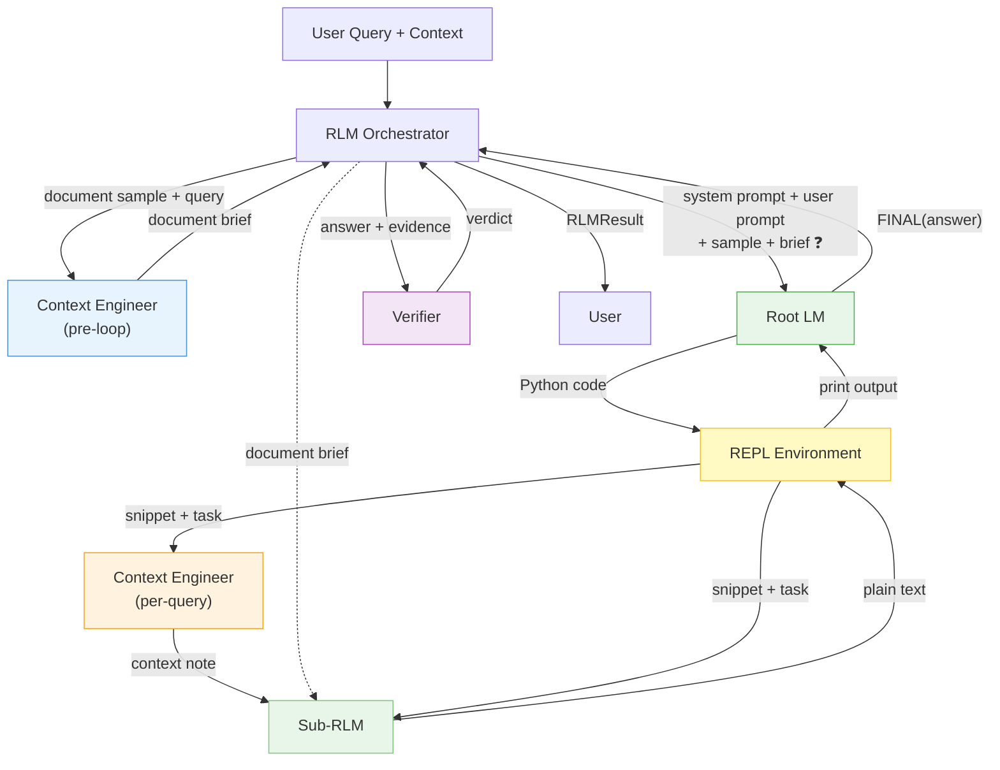

# RLM Algorithm: Implementation vs. Paper Comparison

Comparison of our `rlm-loop` implementation against the original MIT CSAIL paper
([arXiv:2512.24601](https://arxiv.org/pdf/2512.24601)).

---

## Our Algorithm (as implemented)

```
User Query + Context (file/dir/string)
        │
        ▼
1. Materialize context → plain Python str
2. Optionally build "context sample" (--no-context-sample disables)
3. Create depth-tracked llm_query(snippet, task) closure (max_depth=3)
4. Initialize REPLEnv with namespace: CONTEXT, FILES, llm_query, FINAL,
   SHOW_VARS, pre-imported modules
        │
        ▼
5. [Context Engineer — pre_loop] (if --context-engineer-mode includes pre_loop)
   Analyze document sample → produce "document brief" (200-500 words)
   Optionally share brief with root LM (--share-brief-with-root)
        │
        ▼
6. Send to LLM: system prompt (full/compact) + user query [+ context sample]
   [+ document brief if share_brief_with_root]
        │
        ▼
┌─── RLM Loop (max_iterations, timeout, token budget) ────────┐
│                                           │
│  7. Check timeout / token budget guards   │
│  8. LLM responds with markdown            │
│  9. Extract ```python blocks (regex)      │
│ 10. If no code blocks:                    │
│       - Check for "FINAL" in text → done  │
│       - Else prompt LLM to write code     │
│ 11. Execute each code block sequentially  │
│       in persistent REPL namespace        │
│       ├── llm_query(snippet, task):       │
│       │   a. [Context Engineer — per_query]│
│       │      (if mode includes per_query) │
│       │      Produce context note from    │
│       │      surrounding text             │
│       │   b. Sub-RLM receives:            │
│       │      [document brief] +           │
│       │      [context note] +             │
│       │      snippet + task               │
│       │   c. Returns plain text           │
│ 12. If FINAL() called → done              │
│ 13. Feed captured print() output back     │
│       as user message: "Output:\n..."     │
│ 14. Continue loop                         │
│                                           │
└─────────────────────────────────────────────────────────────┘
        │
        ▼
Return RLMResult(answer, stats, history)
```

Key files: `rlm/rlm.py` (orchestrator), `rlm/repl.py` (REPL environment),
`rlm/prompts.py` (system prompts), `rlm/backends.py` (LLM backends)

### LLM Role Interaction (Sequence Diagram)

Shows the full interaction between all four LLM roles during a single
`completion()` call with `context_engineer_mode="both"`, `share_brief_with_root=True`,
and `verify=True` (all features enabled).



### Data Flow Between Roles

Shows what data each role receives and produces, and how outputs flow to
downstream consumers.



#### Legend

| Arrow | Meaning |
|-------|---------|
| **brief ❓** | Only if `--share-brief-with-root` |
| Solid line | Always active when the role is invoked |
| Dashed line | Conditional on `context_engineer_mode` |

#### What each role sees

| Role | System Prompt | User Message Contains | Produces |
|------|--------------|----------------------|----------|
| **Context Engineer (pre-loop)** | Document analysis specialist prompt | Query + 4 × 600-char document excerpts | Document brief (200–500 words) |
| **Context Engineer (per-query)** | Context note specialist prompt | Task + snippet position + ~500 chars before/after | Context note (50–150 words) |
| **Root LM** | Full strategy prompt (Inspect→Search→Chunk→Synthesize) | Query + document sample [+ brief] | Python code in ` ```python ` blocks |
| **Sub-RLM** | Minimal text-analysis prompt | [Brief] + [context note] + snippet + task | Plain text (summary, extraction, etc.) |
| **Verifier** | Verification prompt | Proposed answer + first 5000 chars of context | "VERIFIED" or "ISSUES: ..." |

---

## Paper's Algorithm

```
User Query + Context
        │
        ▼
1. Store context as CONTEXT variable in Python REPL
2. Provide llm_query(snippet, task) for sub-RLM calls
3. Root LM receives ONLY the query (context is not inline)
        │
        ▼
4. Send to LLM: system prompt + query (no context sample)
        │
        ▼
┌─── Code-Observe-Reason Loop ─────────────┐
│                                           │
│  5. LLM generates Python code             │
│  6. Execute in REPL sandbox               │
│  7. Observe output (truncated)            │
│  8. LLM decides next action:              │
│       - More code (inspect/search/chunk)  │
│       - llm_query() for semantic analysis │
│       - FINAL(answer) when confident      │
│  9. Continue loop                         │
│                                           │
└───────────────────────────────────────────┘
        │
        ▼
Return final answer
```

---

## Side-by-Side Comparison

| Aspect | Paper | Our Implementation | Delta |
|--------|-------|--------------------|-------|
| **Initial context exposure** | Root LM sees only the query; CONTEXT is opaque until code runs | Context sample included by default; `--no-context-sample` disables it | **Aligned** — can now match paper's opaque-context design via flag |
| **`llm_query` signature** | `llm_query(snippet, task)` — two args | `llm_query(snippet, task)` — two args | **Match** |
| **Recursive depth** | Depth-1 only (root → sub-RLM, no deeper) | Configurable `max_depth=3` (supports multi-level recursion) | We're ahead of the paper here |
| **Sub-RLM model** | Smaller/cheaper model for sub-calls (e.g., GPT-5-mini when root is GPT-5) | `--sub-rlm-model` param exists but defaults to same model as `--model`; per-role backends/models via `--config` YAML | Paper's design is more cost-efficient; config file enables it |
| **System prompt for sub-calls** | Not detailed | Minimal task-focused system prompt (text analysis role) | Aligned — sub-calls now receive focused guidance |
| **Termination** | `FINAL()` + max iterations + timeouts | `FINAL()` + max iterations + `--timeout` + `--max-token-budget` | **Match** |
| **Default model** | Not applicable (paper uses specific models per experiment) | `--model` is required (no defaults) | **Aligned** — user must choose explicitly |
| **Code extraction** | Not specified in detail | Regex: `` ```python\n(.*?)``` `` — only explicitly tagged Python blocks | Reasonable; ignores non-Python fenced blocks |
| **Structured output** | Not discussed (implicitly uses free-form text) | `LLMBackend.supports_structured_output` property (default `False`); `StructuredResponse` dataclass and `STRUCTURED_RESPONSE_SCHEMA` for JSON-schema mode; `CompletionResult.structured` carries parsed response when available | Extension beyond the paper; interface only — no backends implement it yet |
| **Sandbox isolation** | Rootless container (security delegated to runtime) | Safe builtins whitelist (no `__import__`, `open`, `exec`) + container delegation | We add in-process restrictions on top of container isolation |
| **Output truncation** | Mentioned (first ~10K chars) | 10,000 char cap per execution | Match |
| **Multi-file support** | Not discussed | `FILES` dict + `CompositeContext` for directories | Extension beyond the paper |
| **Context loading** | Context as string | Memory-mapped files via `LazyContext`, `CompositeContext` for multi-file | Engineering refinement beyond the paper |
| **Async execution** | Identified as future work | Stubs exist (`acompletion`) but delegate to sync | Neither implements true async |
| **Native post-training** | RLM-Qwen3-8B (28.3% improvement over base) | Prompt-only, no fine-tuning | Paper has a training component we don't |
| **Cost tracking** | Discussed (comparable median, high variance tail) | `RLMStats` tracks tokens, iterations, sub-RLM calls; `--max-token-budget` enforces limits | **Aligned** — cost enforcement now available |
| **Verification strategy** | Some models perform redundant verification sub-calls | `--verify` flag enables explicit verification sub-call on the final answer | Paper observes this as emergent behavior; we formalize it as opt-in |
| **Sub-RLM context** | Sub-RLM receives only snippet + task (no document context) | Context-engineer role can provide document brief and per-query context notes to sub-RLM calls | Extension beyond the paper; opt-in via `--context-engineer-mode` |

---

## LLM Roles

The RLM pattern uses up to four distinct LLM roles with different responsibilities:

### Role Comparison

| Aspect | Root LM | Sub-RLM | Verifier | Context Engineer |
|--------|---------------------------|-----------------|----------|------------------|
| Depth | 0 | 1+ (up to `max_depth`) | 0 (post-processing) | 0 (pre-processing / per-query) |
| System prompt | Full strategy prompt (~120 lines) or compact (~25 lines) | Minimal task-focused prompt | Verification-focused prompt | Pre-loop: document analysis prompt; Per-query: context note prompt |
| Conversation | Multi-turn (code → output → code → ... → FINAL) | Single-turn (one prompt, one response) | Single-turn | Single-turn (per invocation) |
| Produces | Python code in ` ```python ` blocks | Plain text (summary, extraction, analysis) | VERIFIED or ISSUES: ... | Document brief (pre-loop) or context note (per-query) |
| Has access to | `CONTEXT`, `FILES`, `llm_query()`, `FINAL()`, `SHOW_VARS()`, pre-imported modules | Only the snippet passed by root + optional brief/note | Proposed answer + evidence | Document sample (pre-loop) or snippet + surrounding text (per-query) |
| Model | `--model` | `--sub-rlm-model` (defaults to `--model`) | Config only (defaults to sub-RLM model) | Config only (defaults to sub-RLM model) |
| Backend | `--backend` or config | Config only (defaults to root's) | Config only (defaults to root's) | Config only (defaults to root's) |
| Custom prompt | Via `--config` `roles.root.system_prompt` | Via `--config` `roles.sub_rlm.system_prompt` | Via `--config` `roles.verifier.system_prompt` | Via `--config` `roles.context_engineer.system_prompt` (pre-loop) and `per_query_prompt` |

### Root LM Responsibilities

The root LM writes Python code to explore the document
programmatically. It never sees the full document inline (unless `--no-context-sample` is
disabled). Instead, it:

1. Receives the user query (and optionally a document sample)
2. Writes exploration code to inspect structure, search for patterns, extract chunks
3. Delegates **semantic** analysis to the sub-RLM via `llm_query(snippet, task)`
4. Aggregates sub-RLM results and calls `FINAL(answer)` when confident

### Sub-RLM Responsibilities

The sub-RLM processes individual text chunks. It:

1. Receives a snippet of text and a task description
2. Returns plain-text results (summaries, extractions, classifications)
3. Has no access to the REPL, `CONTEXT`, or any tools — only the snippet it was given
4. Does not generate code

### Emergent Strategies from the Paper

The paper ([arXiv:2512.24601](https://arxiv.org/pdf/2512.24601)) and the accompanying
[blog post](https://alexzhang13.github.io/blog/2025/rlm/) identify five emergent strategies
that models discover when given the RLM environment:

| Strategy | Description | Example Code |
|----------|-------------|-------------|
| **Peeking** | Inspect document structure and size | `print(CONTEXT[:1000])`, `print(len(CONTEXT))` |
| **Grepping** | Keyword/regex search to locate relevant regions | `re.findall(r'pattern', CONTEXT, re.IGNORECASE)` |
| **Partition+Map** | Chunk the document and fan out `llm_query()` calls | Split `CONTEXT` into N chunks, call `llm_query()` on each |
| **Summarization** | Hierarchical summarization via sub-RLM calls | Summarize chunks, then summarize the summaries |
| **Long-input/long-output** | Direct extraction for structured outputs | Extract lists, tables, or formatted data from large regions |

Our prompts map these emergent strategies to a prescriptive four-phase model:

| Our Phase | Paper Strategies Covered |
|-----------|------------------------|
| **Inspect** | Peeking |
| **Search** | Grepping |
| **Chunk + Analyze** | Partition+Map, Summarization |
| **Synthesize** | Long-input/long-output, final aggregation |

The paper observes that models discover these strategies naturally with minimal prompting. Our
prompts are more prescriptive (explicit chunk size guidance, specific function examples), which
improves consistency but may constrain creative exploration.

### Context Engineer (Extension Beyond Paper)

The paper's sub-RLM calls operate in complete isolation — each `llm_query(snippet, task)` gives
the sub-RLM only the snippet and task, with no knowledge of the document's type, structure,
terminology, or where the snippet sits. This limits sub-RLM accuracy for domain-specific
documents (legal contracts, research papers, technical specs).

Our context-engineer role addresses this limitation with two configurable intervention points:

| Mode | When | LLM Calls | What it does |
|------|------|-----------|-------------|
| `off` | Never (default) | 0 | Current behavior, matches paper |
| `pre_loop` | Before main loop | 1 | Produces document brief from sample |
| `per_query` | Before each `llm_query()` | N | Adds surrounding context + position metadata |
| `both` | Both points | 1 + N | Brief + per-query enhancement |

**Pre-loop analysis** (`_run_pre_loop_analysis`): Feeds a document sample to the CE backend
and receives a document brief (200-500 words) covering document type, key terminology,
structure, important entities, and writing conventions. The brief is then prepended to every
sub-RLM call, and optionally shared with the root LM (`--share-brief-with-root`).

**Per-query enhancement** (`_enhance_per_query`): Before each `llm_query()`, locates the
snippet within the full CONTEXT, extracts ~500 chars of surrounding text, and calls the CE
backend to produce a context note (50-150 words) about position, terminology references, and
relevant background. The note is prepended to the sub-RLM prompt.

The context-engineer defaults cascade from the sub-RLM role (both are "helper" roles), so
configuring `sub_rlm` in the YAML config automatically applies to `context_engineer` unless
overridden.

### Verification (Emergent Behavior)

The paper observes that some models perform redundant "verification" sub-calls — re-checking
their own intermediate results before calling `FINAL()`. This behavior is emergent and not
prompted for. Our implementation offers an explicit `--verify` flag that formalizes this
pattern as an opt-in post-processing step.

---

## Remaining Divergences

### 1. Context Sample in Initial Prompt (our addition, now optional)

**Our approach** (`_build_context_sample()`): By default, sends evenly-spaced 500-char
excerpts from the document in the first message. Can be disabled with `--no-context-sample`
to match the paper's opaque-context design.

**Paper's approach**: Root LM only knows CONTEXT exists. It must write code to inspect it.

**Trade-off**: The default gives the LLM a head start (knows format, size, structure
immediately) but adds tokens to the initial prompt. Use `--no-context-sample` for the
paper's strict "context as environment" paradigm.

### 2. Multi-level Recursion (our extension)

**Paper**: Depth-1 only (root → sub-RLM, no deeper).

**Ours**: Configurable `max_depth=3` (supports multi-level recursion).

This is an intentional extension beyond the paper's design.

---

## Emergent Strategy Comparison

Both the paper and our prompts describe the same four-phase strategy:

| Phase | Paper | Our Prompts |
|-------|-------|-------------|
| **Inspect** | Examine context structure, size, format | If sample provided, study it; otherwise `print(CONTEXT[:1000])` |
| **Search** | Regex/keyword filtering to narrow focus | "Start BROAD: `re.findall(pattern, CONTEXT)` with `re.IGNORECASE`" |
| **Chunk** | Uniform or semantic partitioning | "Extract sections: `CONTEXT[start:end]` (aim for 1000-5000 chars)" |
| **Synthesize** | Aggregate sub-RLM results + FINAL() | "Combine and call `FINAL(answer)`" |

Our prompts also include guidance on when to use `llm_query()` (semantic tasks) vs Python
directly (structural tasks). The paper observes these strategies as emergent behavior that
models discover with minimal prompting; our prompts are more prescriptive to improve
consistency.

---

## Future Refinement Candidates

Actionable items identified by this comparison:

- **Default to a cheaper model for sub-RLM calls** — leverage `--sub-rlm-model` param with a smaller default
- **Evaluate prompt prescriptiveness** — test whether our detailed prompts help or constrain the LLM compared to the paper's minimal approach
- **Native post-training** — the paper fine-tuned RLM-Qwen3-8B (28.3% improvement over base); we rely on prompt-only guidance
- **True async execution** — replace sync-delegating `acompletion` stubs with genuine async REPL execution
- **Context-engineer token budget** — CE calls currently draw from the same `max_token_budget`; per-query mode (N calls) can exhaust budget faster; consider separate budgets or adaptive call limits
- **Context-engineer snippet location** — `_enhance_per_query()` uses `context_str.find(snippet[:200])` which can fail if the root LM transforms the snippet; more robust matching (fuzzy, n-gram) could improve hit rate
- **Structured output backend implementations** — `LLMBackend` ABC now defines `supports_structured_output` and `StructuredResponse`/`STRUCTURED_RESPONSE_SCHEMA`; concrete backends (Anthropic, OpenAI-compatible) need to implement JSON-schema response mode to replace regex-based code extraction
